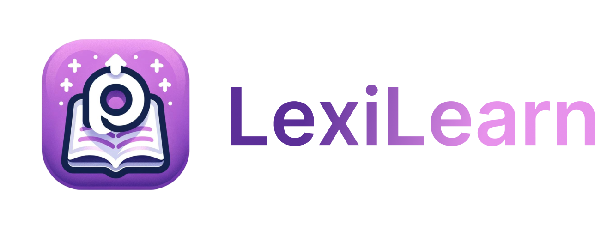

---

##### LexiLearn  is an innovative educational app tailored to overcome the challenges dyslexic children face with literacy. By providing a personalized learning experience with interactive features such as alphabet spelling, word assembly, and letter writing exercises

---

System requirements:
1. Laptop/Computer
2. Connection
3. BUN v1.1.7 or higher
4. Supabase connection url

To install dependencies:
```sh
bun install
cp .env.example .env
```
Edit the ``.env``
To run:
```sh
bun dev
```

open http://localhost:{port}
